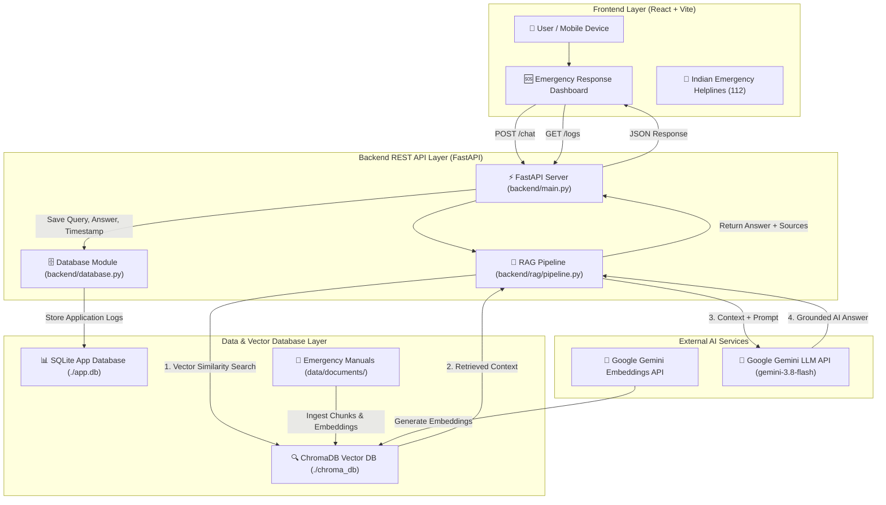

# 🚨 AI Emergency Response Assistant

An end-to-end, Generative AI application providing immediate, situation-specific, step-by-step emergency guidance grounded in verified emergency response protocols using **Retrieval-Augmented Generation (RAG)** and **Google Gemini**.

---

## 📌 Problem Statement

During high-stress emergency situations (such as house fires, earthquakes, flash floods, or severe medical events), individuals often panic and struggle to find reliable, actionable safety instructions. Generic search engine queries often return overwhelming, unverified, or fragmented advice that is difficult to parse when every second matters.

The **AI Emergency Response Assistant** solves this problem by retrieving verified safety protocols from official emergency response manuals and leveraging Google Gemini to generate immediate, prioritized, step-by-step guidance grounded strictly in trusted documentation.

---

## 🎯 Target Users

- **Students & Educational Institutions**: Quick safety steps during school or campus emergencies.
- **Families & Households**: Clear instructions for domestic accidents, kitchen fires, or severe weather.
- **General Public**: Instant access to emergency protocols during natural disasters.
- **Individuals in Crisis**: Anyone needing immediate emergency safety guidance alongside quick access to emergency helplines.

---

## 🏆 Expected Outcomes

- **Situation-Specific Guidance**: Tailored advice for specific fire, earthquake, flood, CPR, or disaster queries.
- **Actionable Step-by-Step Plans**: Direct, numbered instructions prioritized by life-safety urgency.
- **Grounded & Verifiable Answers**: Strict reliance on official emergency manuals to prevent AI hallucinations.
- **Transparent Source Citation**: Every response cites the exact document sources used to construct the answer.
- **Immediate Indian Emergency Helplines**: One-tap calling for **112 National Emergency**, 100 Police, 101 Fire, 102 Ambulance, 1930 Cyber Crime, 1098 Child Helpline, and 181 Women Helpline.

---

## ✨ Features

- 🚨 **One-Tap Indian Emergency Helpline (112)**: Prominent call button for immediate emergency dispatch.
- 🤖 **Grounded AI Emergency Guidance**: Direct situation assessment powered by Google Gemini.
- 📚 **RAG Document Context Retrieval**: Vector similarity search in ChromaDB.
- 📄 **Source Citation & Snippet Inspector**: Transparent listing of official documents and retrieved chunks.
- ⚡ **Quick Emergency Scenarios**: One-tap presets for Fire, Earthquake, Flood, CPR, and Go-Bag preparation.
- 📜 **Emergency Query History**: Persistent query logging stored in a dedicated SQLite database (`app.db`).
- 🟢 **Live Health & Status Monitoring**: Real-time status indicators for backend connectivity and vector DB readiness.

---

## 🛠️ Technology Stack

### Frontend
- **React 18** (UI Component Architecture)
- **Vite 5** (Build & Development Server)
- **Tailwind CSS 3** (Responsive Emergency Dashboard Styling)
- **React Markdown** (Formatted Answer Output)

### Backend
- **Python 3.10+**
- **FastAPI** (Asynchronous REST API Framework)
- **Uvicorn** (ASGI Server)
- **python-dotenv** (Environment Variable Management)

### AI & RAG
- **LLM**: Google Gemini (`gemini-3.8-flash`)
- **Embeddings**: Google Gemini Embeddings (`models/gemini-embedding-001`)
- **RAG Framework**: LangChain
- **Vector Database**: ChromaDB (Local persistent vector store)

### Application Database
- **SQLite** (`app.db` managed via `backend/database.py` for application logs and query history)

---

## 🏗️ System Architecture



### Layer Separation
- **Frontend Layer**: Renders UI components, handles user queries, and displays formatted AI guidance and emergency helplines. Contains zero database credentials or API keys.
- **Backend Layer**: Hosts the REST API endpoints, coordinates RAG retrieval, invokes Gemini LLM, and manages business logic.
- **Application Database (SQLite)**: Manages application data (`emergency_logs` history table).
- **Vector Database (ChromaDB)**: Manages document chunk embeddings for similarity search.
- **LLM Service (Google Gemini)**: Generates natural language emergency guidance based on retrieved context.

---

## 🧠 RAG Pipeline

```text
Official Documents (data/documents/)
        ↓
Text Extraction & Chunking (RecursiveCharacterTextSplitter)
        ↓
Google Gemini Embeddings (models/gemini-embedding-001)
        ↓
Vector Database Persistence (ChromaDB at ./chroma_db)
        ↓
User Query → Vector Similarity Retrieval
        ↓
Top-K Context Chunks + Safety System Prompt
        ↓
Google Gemini 3.8 Flash Generation
        ↓
Grounded AI Guidance Answer + Verified Source Citations
```

---

## 🗄️ Database Architecture

The project strictly separates **Application Data** from **Vector Storage**:

1. **Application Database (`SQLite` -> `app.db`)**:
   - Manages application history and log entries.
   - Table `emergency_logs`: `id`, `query`, `answer`, `timestamp`, `sources`.
   - Populated automatically whenever `/chat` processes a query.
   - Retrievable via `GET /logs`.

2. **Vector Database (`ChromaDB` -> `./chroma_db`)**:
   - Manages mathematical vector embeddings of document chunks.
   - Handles top-K semantic search during user queries.

---

## 📁 Project Structure

```text
creozen-ai-emergency-assistant/
├── README.md               # Complete project documentation
├── .gitignore              # Ignores .env, virtualenv, node_modules, chroma_db, app.db
├── .env.example            # Root environment variable template
├── data/
│   └── documents/          # Verified Emergency Knowledge Base
│       ├── fire_safety.txt
│       ├── earthquake_safety.txt
│       ├── flood_safety.txt
│       └── emergency_preparedness.txt
├── backend/
│   ├── main.py             # FastAPI REST server & API endpoints
│   ├── database.py         # SQLite logging setup & query history
│   ├── requirements.txt    # Backend Python dependencies
│   ├── .env.example        # Backend environment template
│   └── rag/
│       ├── __init__.py     # RAG module initializer
│       ├── ingest.py       # Document chunking, embeddings & ChromaDB ingestion
│       └── pipeline.py     # Context retrieval & Gemini LLM orchestration
└── frontend/
    ├── package.json        # Frontend Node dependencies & scripts
    ├── vite.config.js      # Vite build configuration
    ├── index.html          # Main HTML entry point
    ├── .env.example        # Frontend environment template
    └── src/
        ├── main.jsx        # React entry point
        ├── App.jsx         # Emergency Assistant React Dashboard
        └── index.css       # Tailwind CSS & high-contrast input styling
```

---

## ⚙️ Setup & Installation Instructions

### Prerequisites
- **Python 3.10+**
- **Node.js 18+** & **npm**
- **Google Gemini API Key** ([Get a key from Google AI Studio](https://aistudio.google.com/app/apikey))

---

### Step 1: Backend Setup & RAG Ingestion

1. Open a terminal and navigate to the project root:
   ```bash
   cd creozen-ai-emergency-assistant
   ```

2. Create and activate a Python virtual environment (recommended):
   ```bash
   python -m venv venv
   # On Windows (PowerShell):
   .\venv\Scripts\Activate
   # On macOS/Linux:
   # source venv/bin/activate
   ```

3. Install backend dependencies:
   ```bash
   pip install -r backend/requirements.txt
   ```

4. Configure your environment variables:
   Copy `backend/.env.example` to `backend/.env`:
   ```bash
   cp backend/.env.example backend/.env
   ```
   Edit `backend/.env` and paste your Gemini API key:
   ```env
   GOOGLE_API_KEY=AIzaSy...your_gemini_api_key_here
   ```

5. Run RAG Document Ingestion:
   ```bash
   python -m backend.rag.ingest
   ```

6. Start the FastAPI Backend Server:
   ```bash
   python -m uvicorn backend.main:app --reload --port 8000
   ```
   *The backend runs at `http://localhost:8000`. Access interactive Swagger docs at `http://localhost:8000/docs`.*

---

### Step 2: Frontend Setup

1. Open a second terminal window and navigate to `frontend/`:
   ```bash
   cd frontend
   ```

2. Configure frontend environment variables:
   Copy `.env.example` to `.env`:
   ```bash
   cp .env.example .env
   ```

3. Install Node dependencies:
   ```bash
   npm install
   ```

4. Start the Vite development server:
   ```bash
   npm run dev
   ```

5. Open your browser at **`http://localhost:5173`**.

---

## 🔑 Environment Variables Configuration

| Variable | Location | Description |
| :--- | :--- | :--- |
| `GOOGLE_API_KEY` | `backend/.env` | Google Gemini API Key starting with `AIzaSy...` |
| `CHROMA_DB_DIR` | `backend/.env` | Path to persistent ChromaDB directory (`./chroma_db`) |
| `SQLITE_DB_PATH` | `backend/.env` | Path to SQLite database file (`app.db`) |
| `PORT` | `backend/.env` | Backend API port (default: `8000`) |
| `ALLOWED_ORIGINS` | `backend/.env` | Configured CORS origins (`http://localhost:5173,http://localhost:3000`) |
| `VITE_API_BASE_URL` | `frontend/.env` | Backend API endpoint URL (`http://localhost:8000`) |

*Note: All `.env` files are excluded from Git version control via `.gitignore`.*

---

## 📡 REST API Documentation

| Method | Endpoint | Description |
| :--- | :--- | :--- |
| `GET` | `/` | Root endpoint displaying API status |
| `GET` | `/health` | Health check endpoint returning API key & vector store readiness |
| `POST` | `/chat` | Processes emergency queries through RAG and logs output to SQLite |
| `POST` | `/ingest` | Triggers document chunking and vector embedding ingestion |
| `GET` | `/logs` | Returns recent emergency query history from SQLite |
| `GET` | `/history` | Alias for `/logs` |

---

## 🌐 Live Demo & Deployment Status

| Service | Host / Platform | Status | URL |
| :--- | :--- | :---: | :--- |
| **Frontend UI / Live Website** | **Netlify** | 🟢 **LIVE** | [https://ai-emergency-assist.netlify.app/](https://ai-emergency-assist.netlify.app/) |
| **Backend REST API** | **Render** | 🟢 **LIVE** | [https://ai-emergency-assist.onrender.com](https://ai-emergency-assist.onrender.com) |
| **Interactive API Documentation** | **Render (FastAPI Docs)** | 🟢 **LIVE** | [https://ai-emergency-assist.onrender.com/docs](https://ai-emergency-assist.onrender.com/docs) |
| **API Health Check** | **Render** | 🟢 **LIVE** | [https://ai-emergency-assist.onrender.com/health](https://ai-emergency-assist.onrender.com/health) |
| **GitHub Repository** | **GitHub** | 🟢 **PUBLIC** | [https://github.com/Jithesh-26/ai-emergency-assist](https://github.com/Jithesh-26/ai-emergency-assist) |

- **Frontend**: **LIVE on Netlify** (`https://ai-emergency-assist.netlify.app/`)
- **Backend**: **LIVE on Render** (`https://ai-emergency-assist.onrender.com`)
- **GitHub Repository**: [https://github.com/Jithesh-26/ai-emergency-assist](https://github.com/Jithesh-26/ai-emergency-assist)

---

## 🔒 Security & Secret Protection

- All secret API keys are loaded strictly from `.env` environment variables via `python-dotenv`.
- All `.env`, `backend/.env`, `app.db`, and `chroma_db/` files are explicitly ignored in `.gitignore`.
- Zero API keys, passwords, or tokens are committed to source code or Git version control.

---

## 🔮 Future Enhancements

- **Agentic AI Integration**: Autonomous multi-step tool-calling agent to automatically dispatch geolocation alerts, evaluate weather APIs, or invoke local triage tools.
- **Multilingual Support**: Real-time translation of safety plans into regional Indian languages (Hindi, Tamil, Bengali, Marathi, etc.).
- **Offline PWA Capabilities**: Caching emergency guides locally on mobile devices for offline access during power grid outages.

---

## 🛡️ License

MIT License. Created for NEXT WAVE AI Competition.
